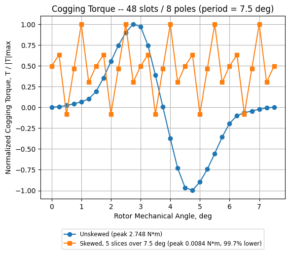

# Toyota Prius 2004 Motor: FEMM Sector Model

A 2D magnetostatic finite-element model of the 2004 Toyota Prius traction motor
(interior permanent magnet, V-shaped magnets, 48 slots / 8 poles), built and
solved in [FEMM](https://www.femm.info/) through its Python API (`pyfemm`).

To save solve time, the model simulates one **45° sector** (6 slots, 1 pole)
instead of the full machine. Anti-periodic boundaries on the sector cuts stand
in for the rest of the motor, and a **sliding band** in the airgap rotates the
rotor without redrawing the geometry.

## Requirements

- Windows with [FEMM 4.2](https://www.femm.info/wiki/Download) installed
- Python 3.8+
- Python packages: `pyfemm`, `matplotlib`

```
pip install pyfemm matplotlib
```

## Repository layout

| File | Purpose |
| --- | --- |
| [`config.py`](config.py) | All parameters: geometry, mesh sizes, windings, and sweep settings |
| [`simulation.py`](simulation.py) | Builds the model: geometry, materials, windings, boundary conditions. Also runs on its own to build, save and solve one model (`ToyotaPrius.FEM`) |
| [`cogging_torque.py`](cogging_torque.py) | Cogging torque sweep (no current) |
| [`static_current_rotor_spinning.py`](static_current_rotor_spinning.py) | Torque vs rotor position with fixed phase currents |
| [`torque_vs_current.py`](torque_vs_current.py) | Peak torque vs current amplitude (Kt curve) |
| [`notes/`](notes/) | Dated working notes |

## Running a simulation

Each script opens FEMM, builds the model, then **pauses so you can inspect the
geometry**. Press Enter in the terminal to start the sweep. Results are saved as
CSV and PNG files, and the plots are shown when the run finishes.

### Cogging torque

```
python cogging_torque.py
```

Runs with no current in the windings (slots filled with air) and rotates the
rotor over one cogging period (7.5° mechanical, 30 steps). The stator and rotor
steel are split into extra regions so the areas facing the airgap can be meshed
more finely than the bulk steel.

Output goes to `Cogging_outputs/`: the model (`.FEM`), results (`.csv`), plot
(`.png`), and an image of the initial mesh (`.bmp`).



### Torque vs rotor position (fixed currents)

```
python static_current_rotor_spinning.py
```

Holds the phase currents fixed (`I_A`, `I_B`, `I_C` at the top of the script)
and rotates only the rotor across one electrical period (90° mechanical, 15
steps). Prints the maximum torque and the angle where it occurs.

Output: `static_current_rotor_spinning.csv` and
`static_current_rotor_spinning_vs_angle.png`.


### Torque vs current (Kt curve)

```
python torque_vs_current.py          # all currents in config.TorqueVsCurrentAmps
python torque_vs_current.py 150      # a single current amplitude, in A
```

Holds the rotor fixed and, for each current amplitude, sweeps the current phase
from 0° to 176° electrical to find the peak torque. This gives the peak-torque
vs current curve, for comparison with published Prius data.

Output: `torque_vs_current.csv` (every point), `torque_vs_current_kt.csv`
(peaks), and the plots `torque_vs_current_phase.png` and
`torque_vs_current_kt.png`.

## Model details

- **Units:** inches; stack length 3.3 in.
- **Materials:** M19_29G electrical steel (nonlinear B-H curve), N36Z_20
  magnets, 19 AWG copper windings.
- **Windings:** 3-phase, 117 turns per coil side, one pole of the `AABBCC`
  slot pattern.
- **Torque:** calculated with FEMM's air-gap integral on the sliding band
  (`mo_gapintegral`).
- **Mesh:** every region has its own mesh size in `config.py`. Smartmesh
  (automatic sizing) was found to badly underestimate torque, so the airgap
  mesh is sized manually.

> **Note:** all mesh sizes in `config.py` are currently set to a coarse `0.5` in.
> The comment next to each one gives its previous, finer value (for example the
> airgap was `0.0025`). Restore those values for accurate results. Coarse meshes
> run quickly but are only suitable for checking that the model works.

## Status

The cogging torque result is about 35% off published results from commercial
software, even after mesh refinement. See
[`notes/Toyota_prius_2004_2026-09-26.md`](notes/Toyota_prius_2004_2026-09-26.md).

## References

- Toyota Prius torque calculation (source of the 7.5° initial rotor angle):
  <https://phdengineeringem.blogspot.com/2018/06/toyota-prius-torque-calculation.html>
- FEMM sliding band technique: <https://www.femm.info/wiki/SlidingBand>
