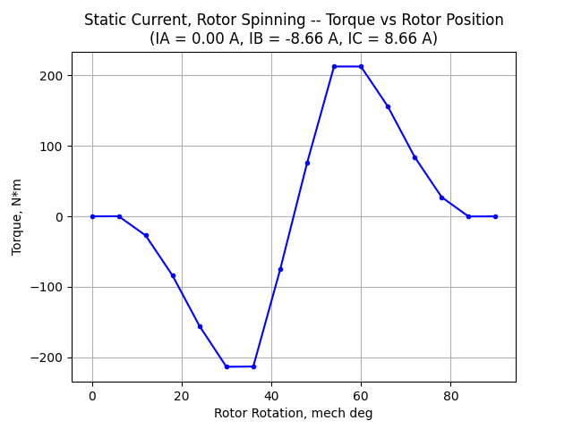
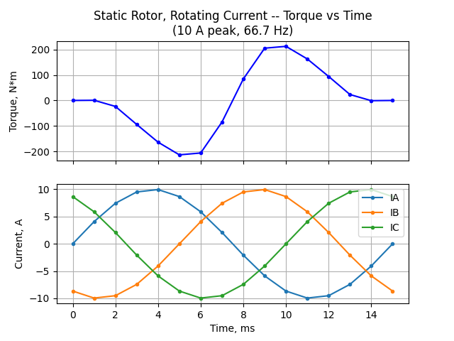

# Toyota Prius 2004 motor: notes (2026-09-26)

## Goal

Electromagnetic simulation of the 2004 Toyota Prius electric motor.

## Work done

### Cogging torque

- Script: [`cogging_torque.py`](../cogging_torque.py)
- Result: after mesh refinement, the cogging torque is still off by **~35%**
  compared with published results from commercial software.
- Plots:
  - [`Cogging_outputs/Cogging_outputs.png`](../Cogging_outputs/Cogging_outputs.png)
  - [`Cogging_outputs_coarse/Cogging_outputs.png`](../Cogging_outputs_coarse/Cogging_outputs.png)
  - [`Cogging_outputs_coarse/Cogging_outputs_coarse_skewed.png`](../Cogging_outputs_coarse/Cogging_outputs_coarse_skewed.png)

  ## Open issues

- The ~35% cogging torque discrepancy is still unexplained.

## Next steps
### Static current, rotor spinning

- Script: [`static_current_rotor_spinning.py`](../static_current_rotor_spinning.py)
- Method: phase currents held fixed at **IA = 0 A, IB = -8.66 A, IC = 8.66 A**;
  only the rotor rotates, across one electrical period (90° mechanical) in
  15 steps of 6°, starting from the 7.5° initial rotor angle.
- Result:
  - Peak torque **≈ ±213 N·m**: -213.5 N·m at 30–36° and +212.6 N·m at 54–60°.
  - Torque is ~0 at 0°, 6°, 84° and 90°, and changes sign between 42° and 48°.
- Data: `static_current_rotor_spinning.csv` (not tracked in git)
- Plot:

  

### Time varying current, rotor static

- Script: [`static_rotor_rotating_current.py`](../static_rotor_rotating_current.py)
- Method: rotor held fixed at the 7.5° initial rotor angle; the 3-phase
  currents vary with time (10 A peak, 66.7 Hz, A-B-C sequence), from 0 to
  15 ms (one electrical period) in 1 ms steps.
  - At t = 0: **IA = 0 A, IB = -8.66 A, IC = 8.66 A**, the same as the
    fixed currents in the static current test.
- Result:
  - Peak torque **≈ ±213 N·m**: -213.6 N·m at 5 ms and +212.5 N·m at 10 ms.
  - Torque is ~0 at 0, 1, 14 and 15 ms, and changes sign between 7 and 8 ms.
- Comparison with the static current, rotor spinning test: 1 ms of current
  (24° electrical) is equivalent to 6° of rotor rotation. The two torque
  curves have the same shape and the same peak (~213 N·m), but differ by up
  to ~10 N·m in between, e.g. 3 ms / 18° (-94.3 vs -84.0 N·m) and
  12 ms / 72° (94.4 vs 84.0 N·m).
- Data: `static_rotor_rotating_current.csv` (not tracked in git)
- Plot:

  
