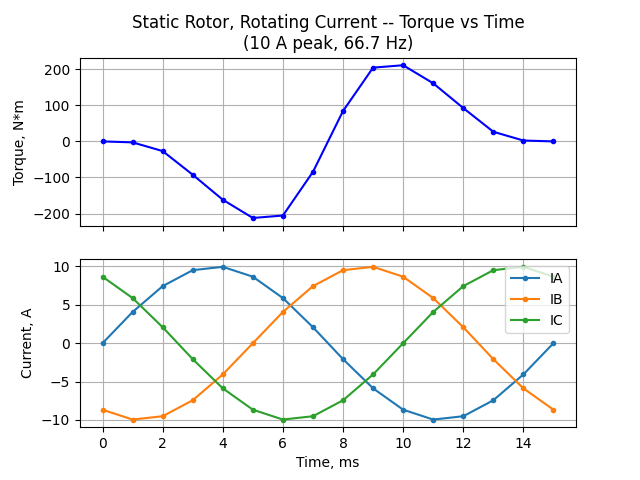
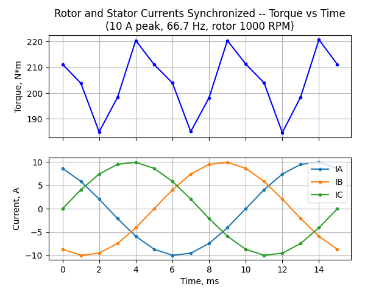
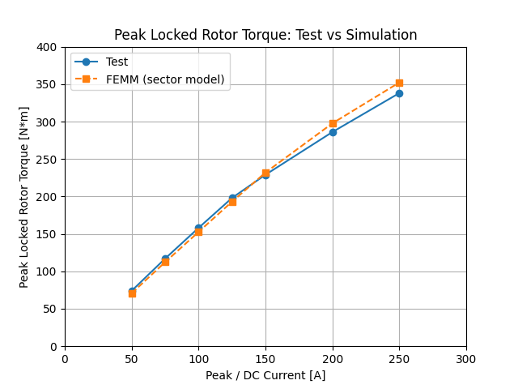
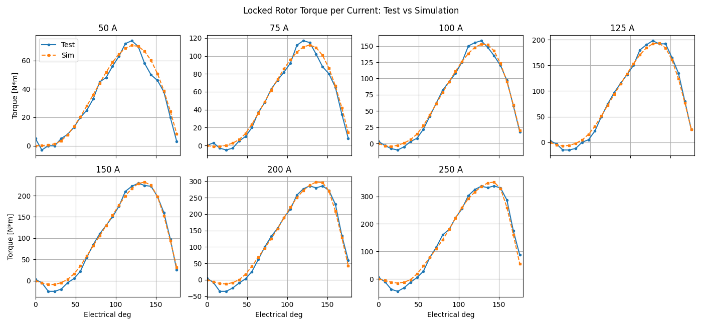
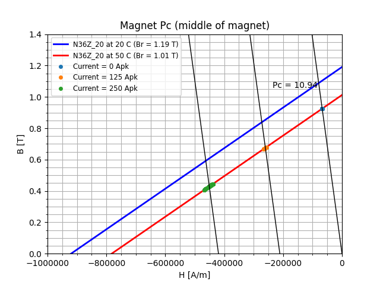
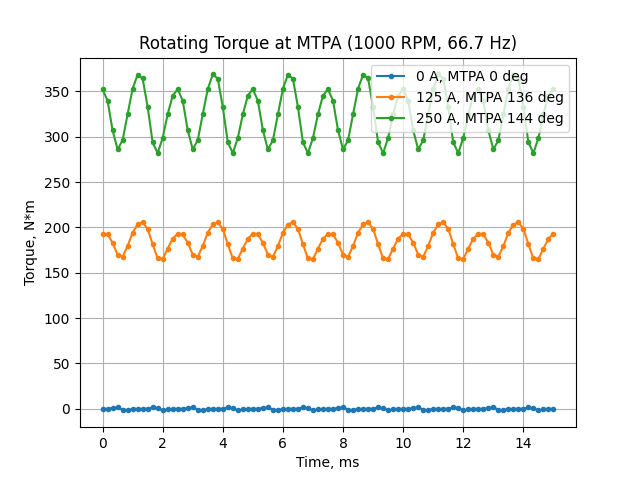

# Toyota Prius 2004 motor: notes (2026-09-26)

## Goal

Electromagnetic simulation of the 2004 Toyota Prius electric motor.

## Work done

### Cogging torque

- Script: [`cogging_torque.py`](../cogging_torque.py)
- Result: after mesh refinement, the cogging torque is still off by **~35%**
  compared with published results from commercial software.
- Plots:
  - [`Cogging_outputs/Cogging_outputs.png`](../Cogging_outputs/Cogging_outputs.png)
  - [`Cogging_outputs_coarse/Cogging_outputs.png`](../Cogging_outputs_coarse/Cogging_outputs.png)
  - [`Cogging_outputs_coarse/Cogging_outputs_coarse_skewed.png`](../Cogging_outputs_coarse/Cogging_outputs_coarse_skewed.png)

  ## Open issues

- The ~35% cogging torque discrepancy is still unexplained.

## Next steps
### Static current, rotor spinning

- Script: [`static_current_rotor_spinning.py`](../static_current_rotor_spinning.py)
- Method: phase currents held fixed at **IA = 0 A, IB = -8.66 A, IC = 8.66 A**;
  only the rotor rotates, across one electrical period (90° mechanical) in
  15 steps of 6°, starting from the 7.5° initial rotor angle.
- Result:
  - Peak torque **≈ ±213 N·m**: -213.5 N·m at 30–36° and +212.6 N·m at 54–60°.
  - Torque is ~0 at 0°, 6°, 84° and 90°, and changes sign between 42° and 48°.
- Data: `static_current_rotor_spinning.csv` (not tracked in git)
- Plot:

  

### Time varying current, rotor static

- Script: [`static_rotor_rotating_current.py`](../static_rotor_rotating_current.py)
- Method: rotor held fixed at the 7.5° initial rotor angle; the 3-phase
  currents vary with time (10 A peak, 66.7 Hz, A-B-C sequence), from 0 to
  15 ms (one electrical period) in 1 ms steps.
  - At t = 0: **IA = 0 A, IB = -8.66 A, IC = 8.66 A**, the same as the
    fixed currents in the static current test.
- Result:
  - Peak torque **≈ ±213 N·m**: -213.6 N·m at 5 ms and +212.5 N·m at 10 ms.
  - Torque is ~0 at 0, 1, 14 and 15 ms, and changes sign between 7 and 8 ms.
- Comparison with the static current, rotor spinning test: 1 ms of current
  (24° electrical) is equivalent to 6° of rotor rotation. The two torque
  curves have the same shape and the same peak (~213 N·m), but differ by up
  to ~10 N·m in between, e.g. 3 ms / 18° (-94.3 vs -84.0 N·m) and
  12 ms / 72° (94.4 vs 84.0 N·m).
- Data: `static_rotor_rotating_current.csv` (not tracked in git)
- Plot:

  

### Rotor and stator currents synchronized (1000 rpm)

- Script: [`rotor_stator_currents_synchronized.py`](../rotor_stator_currents_synchronized.py)
- Method: the 3-phase currents vary with time (10 A peak, 66.7 Hz) and the
  rotor turns at 1000 rpm (6° per 1 ms step) from the 7.5° initial rotor
  angle, from 0 to 15 ms (one electrical period, 90° mechanical).
  - Currents match the reference Octave script: A-C-B sequence, 120°
    starting phase, so at t = 0 **IA = 8.66 A, IB = -8.66 A, IC = 0 A**.
- Changes needed to match the reference script's ~205 N·m ± 20 ripple:
  1. **Rotor bore boundary:** added A = 0 on the rotor ID arc in
     [`simulation.py`](../simulation.py), as in the reference. Before, no
     boundary was set there, so FEMM's default (Neumann) applied. This
     affects every script that builds the model.
  2. **Rotor direction:** the rotor must turn in the positive sliding-band
     direction (`ROTOR_DIRECTION = 1`), same as the reference. The reverse
     direction gave torque swinging between about ±219 N·m.
  3. **Rotor offset:** removed the `- config.SectorAngle` (-45°) offset on
     the sliding-band angle, so the rotor starts at +7.5° like the
     reference. With anti-periodic boundaries, the extra 45° (one pole)
     reversed the magnet polarity: the torque was **-56 N·m** at t = 0
     instead of +211 N·m.
- Result (after the changes):
  - Mean torque **≈ 204 N·m**, ranging from 184.7 to 220.7 N·m
    (about -19 / +17 N·m ripple), which matches the expected 205 N·m ± 20.
  - The ripple repeats every 5 ms (30° mechanical), three times per
    electrical period. With only 1 ms steps, its shape may not be fully
    resolved; the reference script uses 90 steps per period.
- Data: `rotor_stator_currents_synchronized.csv` (not tracked in git)
- Plot:

  
- To do: `static_current_rotor_spinning.py` and `static_rotor_rotating_current.py`
  still use the -45° offset, so their magnets are reversed relative to the
  reference. Their earlier results above were run with it, and without the
  rotor bore boundary. (`torque_vs_current.py`, now `Locked_rotor_test.py`,
  was fixed on 2026-09-27.)

## Update 2026-09-27

### Model changes

- **Materials in one module:** [`materials.py`](../materials.py) holds every
  material name and property (M19_29G B-H curve and stacking factor, N36Z_20
  magnet, 19 AWG copper) and `setup_materials()`. `simulation.py`,
  `phase_resistance_calculation.py` and the plotting scripts read from it.
- **Magnet temperature:** Hc falls linearly with temperature at
  `MagnetHcTempCoef = -0.5` %/°C, with μr = 1.03 constant. At
  `MagnetTemp = 50` °C: Hc = 782 kA/m (9.83 kOe), Br = 1.01 T (920 kA/m and
  1.19 T at 20 °C).
  - -0.5 %/°C is the intrinsic coercivity (Hci) coefficient. Br and normal
    coercivity typically drop ~0.11 %/°C (as in `PM_characteristics.py`),
    which would give ~890 kA/m at 50 °C.
- **Lamination stacking:** the B-H points are corrected for flux parallel to
  the laminations, B = SF·B_solid + (1 − SF)·μ0·H with SF = 0.94
  (`laminated_b()`). `SteelLamFill = 0.94` also applies it in FEMM, which
  matches the reference script but applies the factor twice. Set
  `SteelLamFill = 1` to apply it once.
- **Dimensions:** `Length`, `RotorOD`, `RotorID` and `MagThick` in
  [`config.py`](../config.py) are now the reference's exact mm values
  (`* MM`). The airgap was 6% too wide before (0.775 vs 0.73 mm); it is now
  0.7275 mm.

### Locked rotor test

- Script: [`Locked_rotor_test.py`](../Locked_rotor_test.py) (renamed from
  `torque_vs_current.py`)
- Method: rotor fixed at 7.5° (no -45° offset). For each current (50–250 A
  peak), the current angle is stepped 0–176° electrical in 8° steps.
  Torque from the sliding-band gap integral; the peak per current gives the
  Kt curve.
- Each step saves a |B| density plot (0–2 T, zoom natural) to
  `Locked_rotor_frames/`, stitched into `Locked_rotor_B.mp4` at the end.
- Data: `torque_vs_current.csv`, `torque_vs_current_kt.csv` (the last run
  was 250 A only; rerun all currents before comparing).

### Comparison with the ORNL test

- Script: [`compare_locked_rotor_test.py`](../compare_locked_rotor_test.py)
- Test data read off the plots in: C. W. Ayers et al., *Evaluation of 2004
  Toyota Prius Hybrid Electric Drive System – Interim Report*, Oak Ridge
  National Laboratory, ORNL/TM-2004/247, 2004.
- Result: peak torque within **±4.5%** of the test from 50 to 250 A.

  | Current (A) | Test (N·m) | Sim (N·m) | Diff |
  |---|---|---|---|
  | 50 | 74 | 70.7 | -4.4% |
  | 75 | 117 | 112.2 | -4.1% |
  | 100 | 158 | 152.6 | -3.4% |
  | 125 | 198 | 193.1 | -2.5% |
  | 150 | 229 | 231.9 | +1.3% |
  | 200 | 286 | 297.6 | +4.1% |
  | 250 | 338 | 352.2 | +4.2% |

  - Kt (N·m/A): test 1.48 → 1.58 (100–125 A) → 1.35 (250 A); sim 1.41 →
    1.55 → 1.41. The sim saturates slightly later than the motor.
  - Peak angle matches within one 8° step (120° → 144° as current rises).
  - The test shows slot ripple (moving rotor) and a deeper negative dip at
    16–24° that the fixed-rotor sim can't reproduce.
- Plots:

  
  

### Magnet operating point (rotating rotor)

- Script: [`magnet_operating_point.py`](../magnet_operating_point.py)
- Method: rotor turns at 1000 rpm synchronized with the currents over one
  electrical cycle (15 ms, 90 steps of 1° mechanical) for 0, 125 and 250 A
  at the MTPA current angle (reference angles 80°/132°/142° by default,
  `USE_REFERENCE_MTPA`). At each step B and H at the magnet's middle point
  are projected onto the magnetization direction. `--plot` replots the CSV
  without running FEMM.
- Load lines: no-load Pc from the 0 A point; the 125 A and 250 A lines have
  the same slope, shifted by the stator's demagnetizing field Ha.
- Result (run with 136°/144°, before switching to the reference angles):

  | Current (A) | Mean T (N·m) | Ripple pk-pk | B (T) | H (kA/m) | Ha (kA/m) |
  |---|---|---|---|---|---|
  | 0 | 0 | 3.4 N·m | 0.925 | -68 | 0 |
  | 125 | 184.3 | 40.4 N·m (22%) | 0.667–0.680 | -257 to -267 | -211 |
  | 250 | 324.8 | 86.8 N·m (27%) | 0.406–0.445 | -438 to -468 | -419 |

  - No-load Pc = 10.94 (reference: 10.77). Under load B is ~0.03–0.05 T
    below the reference, likely from the larger MTPA angles used.
- Data: `magnet_operating_point.csv`
- Plots:

  
  

### Supporting calculations (no FEMM)

- [`phase_resistance_calculation.py`](../phase_resistance_calculation.py):
  phase resistance from the winding geometry. DC resistance vs temperature
  (0.0686 Ω at 20 °C, 0.1185 Ω at 200 °C) and AC resistance vs speed from
  the skin effect (skin depth 11.4 mm at 33 Hz to 3.3 mm at 400 Hz).
- [`PM_characteristics.py`](../PM_characteristics.py): N42 demagnetization
  curves rebuilt from datasheet values (3-parameter and 4-parameter models
  with the knee), shifted to 20–100 °C with the Br (-0.11 %/°C) and Hci
  (-0.5 %/°C) coefficients.
- [`torque_calculation_PM+RELUCTANCE.PY`](../torque_calculation_PM+RELUCTANCE.PY):
  dq-axis torque model fitted to the ORNL test, split into magnet and
  reluctance torque. At 250 A and MTPA: ~150 N·m magnet + ~190 N·m
  reluctance torque.

### Open issues

- The cogging study ran with the 6% wider airgap; rerun `cogging_torque.py`
  with the corrected dimensions.
- Check the ~35% cogging figure: 1.98 vs 1.75 N·m is +13%.
- Decide on the magnet temperature coefficient (-0.5 vs ~-0.11 %/°C) and on
  `SteelLamFill` (0.94 vs 1).
